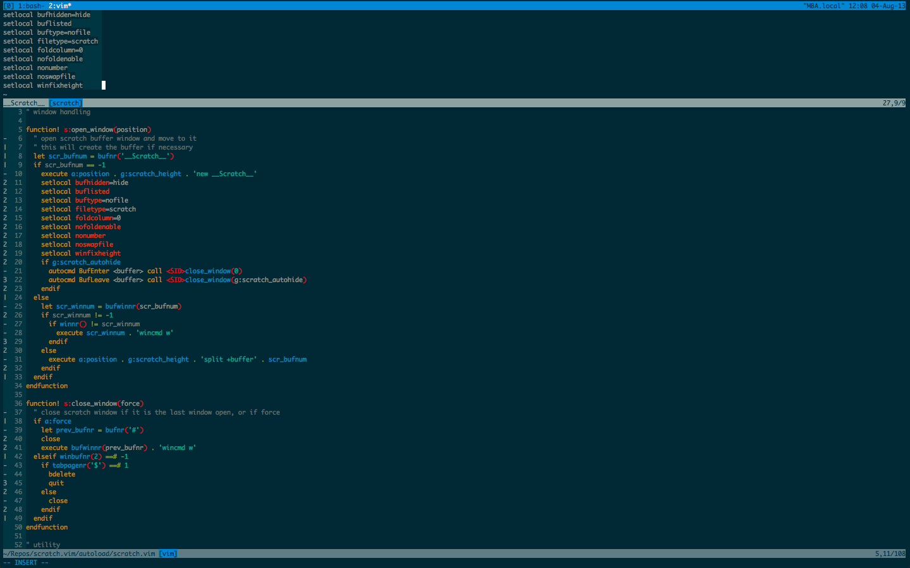

.. default-role:: code

Scratch.vim
===========

Unobtrusive scratch window. Inspired by scratch.vim_, enhanced.

Features
--------

+ Scratch window automatically hides when inactive.
+ Mappings allow easy note taking and selection pasting directly into the 
  scratch buffer.
+ Optional persistence across sessions.

Quickstart
----------

+ `:Scratch` opens a scratch buffer in a new window (by default using the top 
  20% of the screen, configurable via `g:scratch_height` and `g:scratch_top`). 
  The window automatically closes when inactive (and its contents will be 
  available the next time it is opened).
+ `gs` in normal mode opens the scratch window and enters insert mode. The 
  scratch window closes when you leave insert mode. This is especially useful 
  for quick notes.
+ `gs` in visual mode pastes the current selection (character-wise, line-wise 
  or block-wise) into the scratch buffer.

Both above mappings have a `gS` variant that clears the scratch buffer before 
opening it. Note also that the auto-closing features require `hidden` to be set 
(and can be disabled via the `g:scratch_autohide` option).

By default the contents of the scratch window are lost when leaving Vim. To 
enable cross-session persistence, set the `g:scratch_persistence_file` option 
to a valid file path.

See `:help Scratch` for the full list of configuration options and more details 
on each.

Installation
------------

With `Pathogen.vim`_:

.. code:: bash

  git clone https://github.com/mtth/scratch.vim ~/.vim/bundle/scratch

With `Vundle.vim`_:

.. code:: viml

  Plugin 'mtth/scratch.vim'

With `NeoBundle.vim`_:

.. code:: viml

  NeoBundle 'mtth/scratch.vim'

Otherwise simply copy the folders into your `.vim` directory.

.. _pathogen.vim: https://github.com/tpope/vim-pathogen
.. _scratch.vim: https://github.com/vim-scripts/scratch.vim
.. _vundle.vim: https://github.com/gmarik/Vundle.vim
.. _neobundle.vim: https://github.com/Shougo/neobundle.vim
